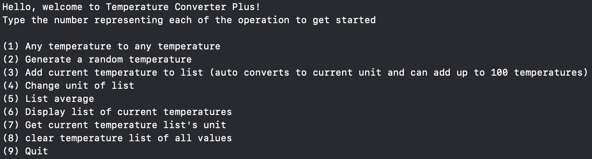
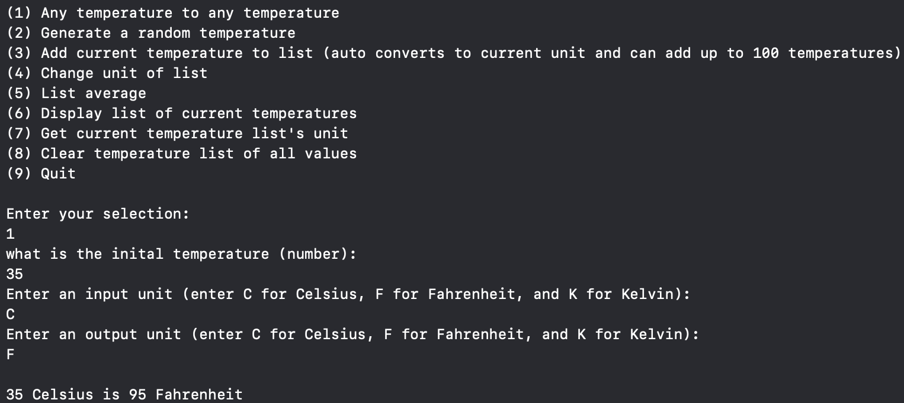
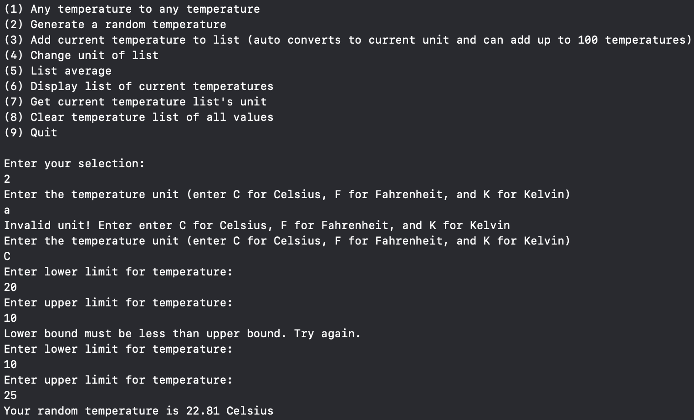
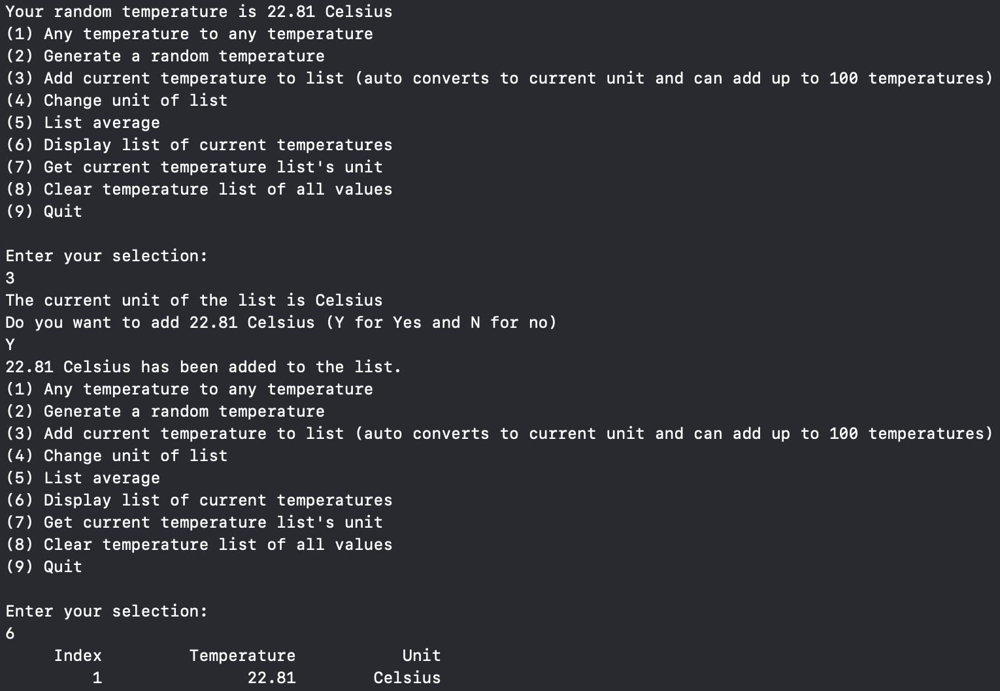

# TemperatureConverter Plus
## Project Overview
TemperatureConverter Plus is a simple yet versatile program designed to convert temperatures between Celsius, Fahrenheit, and Kelvin. It supports multiple features like user-defined conversions, random temperature generation, and temperature list management. The program is built with input validation, precise calculations, and usability in mind.

## Features
Convert between Celsius, Fahrenheit, and Kelvin.
Generate random temperatures within user-defined limits.
Maintain and convert a list of stored temperatures.
Input validation to prevent invalid data (e.g., below absolute zero).
Clear and user-friendly console interface.

## Technology used

C++: Core programming language, leveraging features like type casting, loops, and arrays.

## Screenshots and Video

Program Menu:

Temperature Conversion Example:

Random Temperature generation and some Error handling:

Adding Temperature to list and Display List:

[Video to Link](https://drive.google.com/file/d/1CEQLtJ4r6P2HBBGOPH2ElMnWtPry8_su/view?usp=sharing)

## Author

Isaac Guan
Currently a enrolled BCC and have always been interested in the workings of computers. Aspire to oneday create a game that many people can be enjoyed.

Email address: isaacguan8@gmail.com

Github profile link: https://github.com/IsaacGuan8

## License

This project is licensed under the MIT License. For more details see the LICENSE file.
